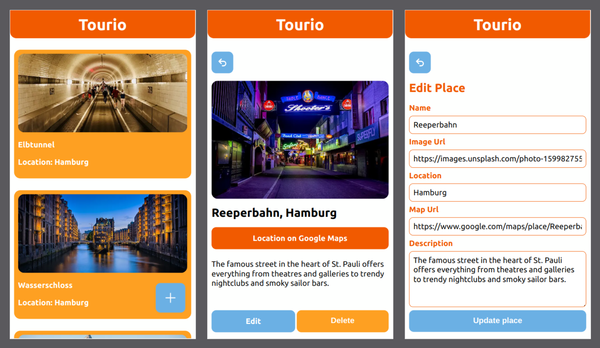

# Tourio App

## technologies used:

- React
- Next.js
- MongoDB
- Git
- npm
- OpenAI API
- LangChain
- Cloudinary
- Jest
- React Testing Library
- SWR
- mongoose
- React Hooks

## setup taskifAI in your own dev environment:

- clone this repository
- install all dependencies with $ npm install
- create Cloudinary, OpenAI and MongoDB Atlas accounts
- create .env file in the root directory and insert enviroment variables in it:
  - MONGODB_URI
  - OPENAI_API_KEY
  - CLOUDINARY_SECRET
  - CLOUDINARY_API_KEY
  - CLOUDINARY_CLOUD_NAME
- run app in dev mode with $ npm run dev
- server: http://localhost:3000/
- run tests via $ npm run test

### Local development

To run project commands locally, you need to install the dependencies using `npm i` first.

You can then use the following commands:

- `npm run dev` to start the development server
- `npm run build` to create a production build
- `npm run start` to start the production build
- `npm run test` to run the tests in watch mode (if available)

> 💡 This project requires a bundler. You can use `npm run dev` to start the development server. You can then view the project in the browser at `http://localhost:3000`. The Live Preview Extension for Visual Studio Code will **not** work for this project.
